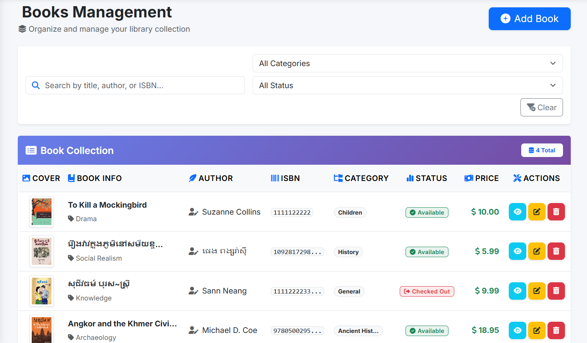
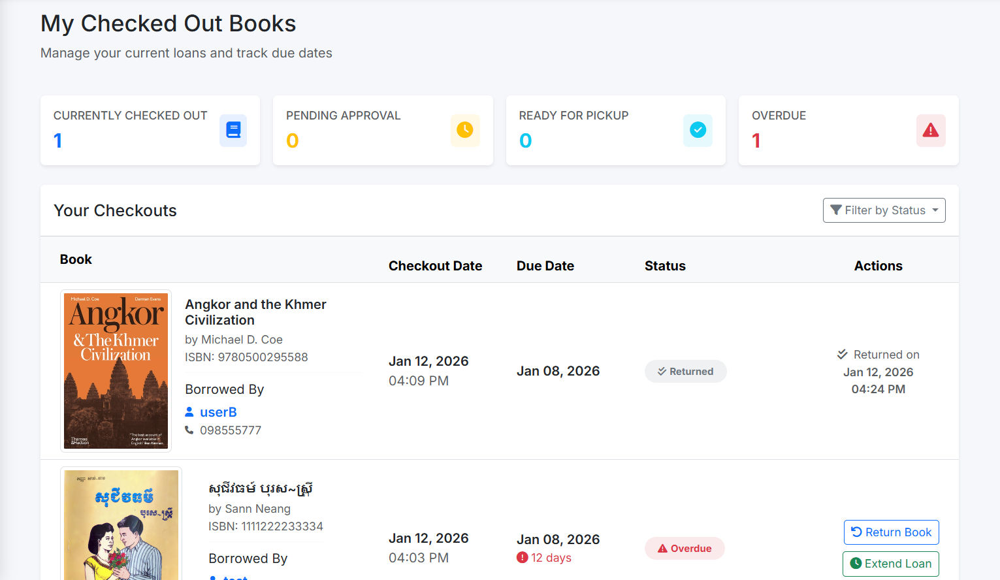
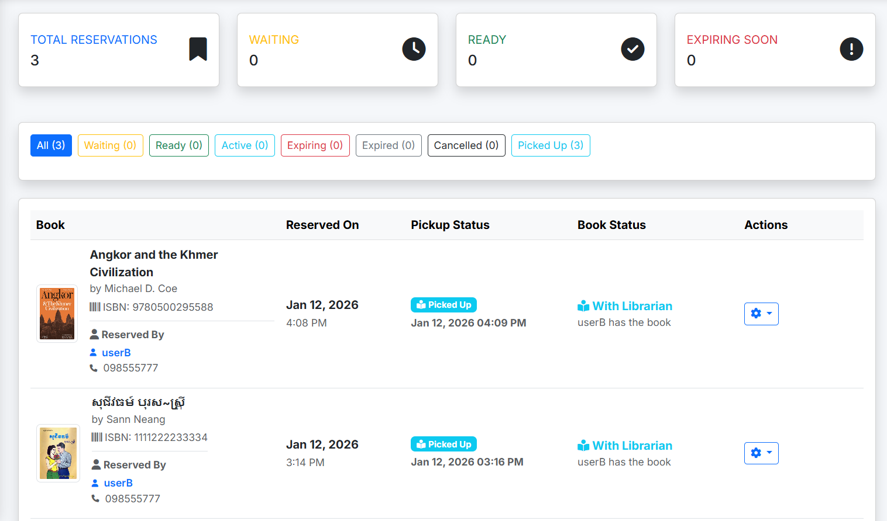
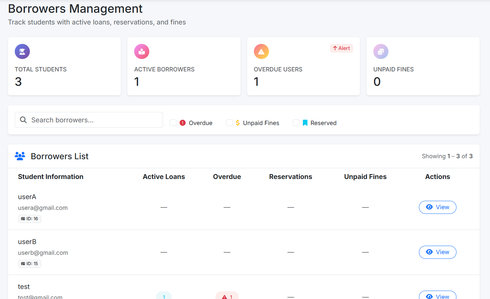
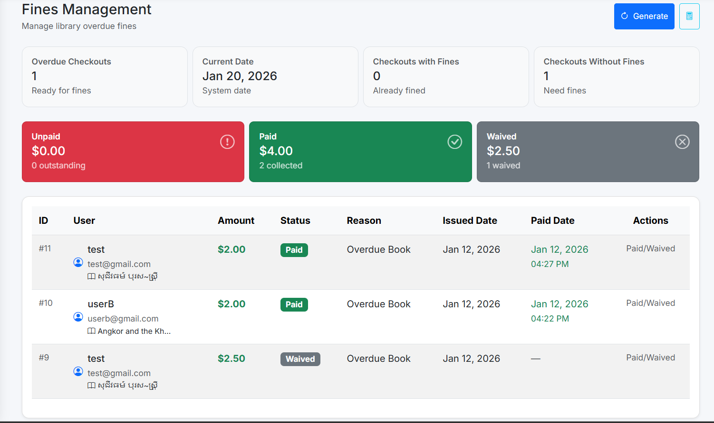

# Library Management System

## Description

The Library Management System is a web-based application designed to manage
library operations efficiently. It allows users to borrow, return, extend,
and reserve books, while providing librarians with full administrative control.

## Features

### User Features

- Borrow and return books
- Extend book checkout period (up to 3 additional days)
- Reserve books that are currently checked out
- View borrowed and reserved books
- View overdue fines ($0.50 per day)

### Librarian (Admin) Features

- Manage books (add, update, delete)
- Manage users
- Handle book checkout and return operations
- Manage reservations
- Calculate overdue fines automatically
- **Print reports for unpaid fines only**
- Monitor library activities

## Fine Policy

- Overdue books are charged **$0.50 per day**
- Fine calculation starts from **1 day overdue**
- Fines are tracked as **paid or unpaid**

## Technologies Used

- HTML, CSS, JavaScript
- PHP / Laravel
- MySQL Database

### Login Page

### Book List

### Checkout List

### Reservation List

### User List

### Fine List (Unpaid Fines)

## System Roles

- **User:** View borrowed, currently checked-out, and reserved books; borrow and return books; extend checkout periods; and make reservations
- **Librarian (Admin):** Manage books, users, checkouts, returns, reservations, fines, and generate unpaid fine reports

## Reports

- Unpaid fine report generation

## Project Type

Academic / School Project
